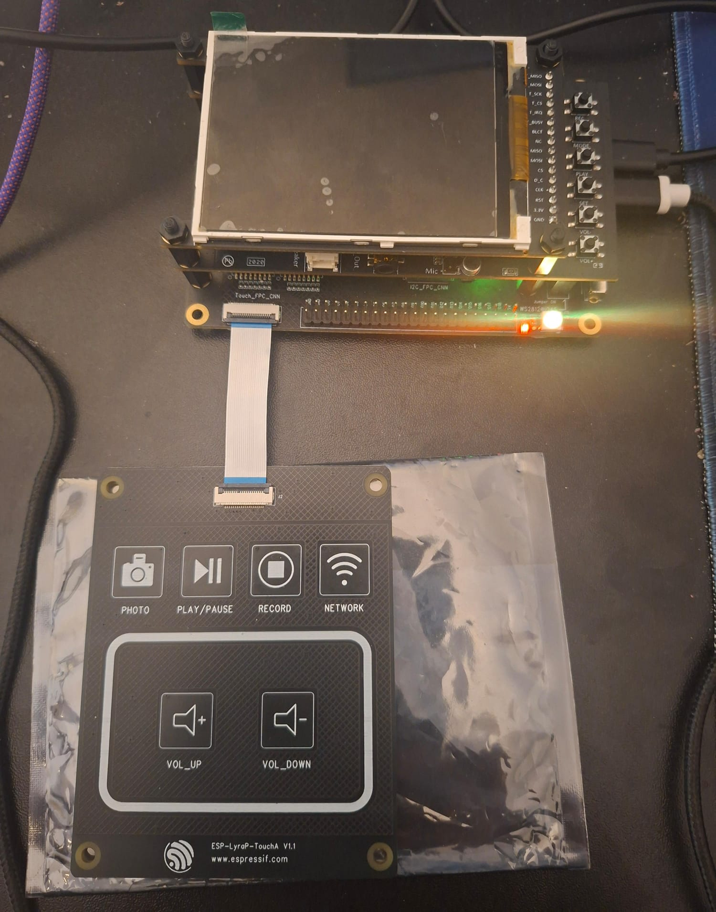
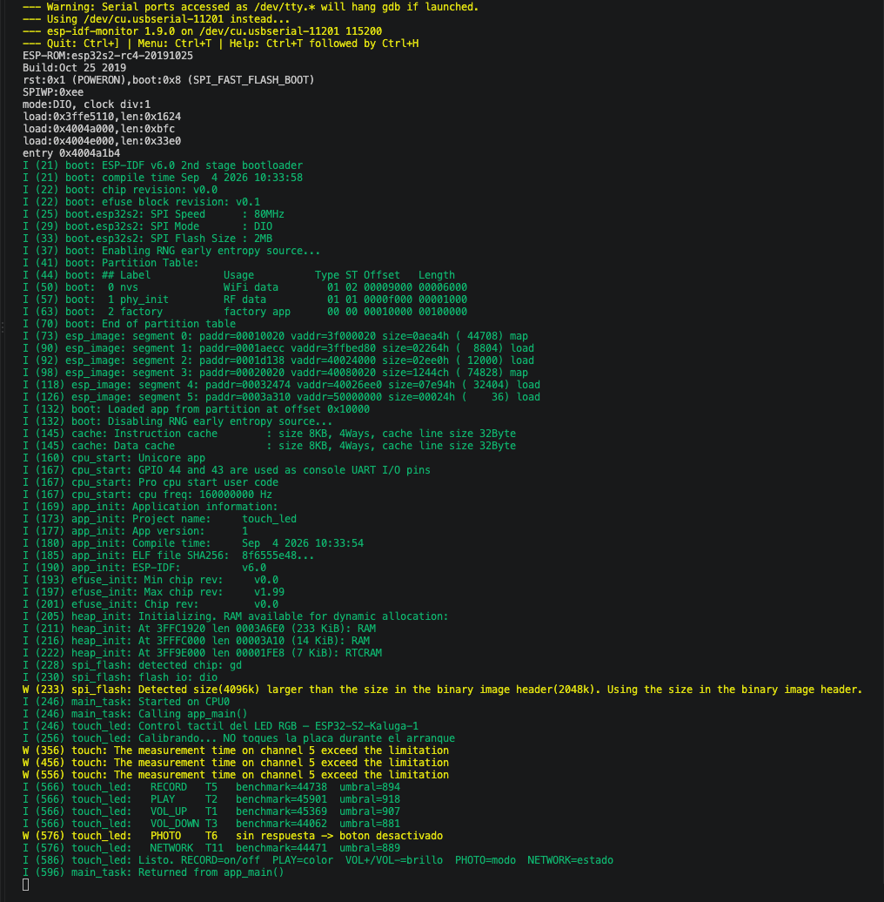
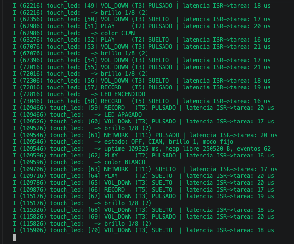

# Touch LED - ESP32-S2 Kaluga-1

Proyecto realizado para la materia **Diseño de IoT y Sistemas Embebidos**.

La idea del ejercicio es controlar el LED RGB de la Kaluga-1 usando los botones táctiles de la placa ESP-LyraP-TouchA.

Los botones se detectan mediante interrupciones (`on_active` y `on_inactive`). La interrupción solamente agrega el evento a una cola y después una tarea de FreeRTOS se encarga de procesarlo y modificar el LED.

## Hardware utilizado

- ESP32-S2-Kaluga-1
- ESP-LyraP-TouchA
- Cable FPC de 20 pines
- Mac con VS Code y ESP-IDF 6.0.0
- Dos cables USB, uno para alimentación y otro para UART



## Botones

Los botones configurados en el proyecto son:

| Botón | Canal | Acción |
|---|---|---|
| RECORD | T5 | Encender/apagar LED |
| PLAY | T2 | Cambiar color |
| VOL_UP | T1 | Subir brillo |
| VOL_DOWN | T3 | Bajar brillo |
| PHOTO | T6 | Activar/desactivar parpadeo |
| NETWORK | T11 | Mostrar estado |

## Calibración

Al encender la placa el programa realiza una calibración automática de los sensores táctiles.

Es importante no tocar los botones mientras se está realizando.

En mi prueba obtuve:

| Botón | Benchmark | Umbral |
|---|---:|---:|
| RECORD | 44738 | 894 |
| PLAY | 45901 | 918 |
| VOL_UP | 45369 | 907 |
| VOL_DOWN | 44062 | 881 |
| NETWORK | 44471 | 889 |

El botón PHOTO (T6) no respondió durante esta calibración y el programa lo desactivó. Los otros cinco botones siguieron funcionando correctamente.



## Compilar y ejecutar

Primero se selecciona el ESP32-S2:

```bash
idf.py set-target esp32s2
```

Luego se compila:

```bash
idf.py build
```

Y para flashear la placa y abrir el monitor serie:

```bash
idf.py -p /dev/cu.usbserial-11201 flash monitor
```

El puerto puede cambiar dependiendo de la computadora.

## Resultado

Después de flashear el programa probé los distintos botones táctiles.

Por el monitor serie se puede ver cuándo un botón es pulsado y cuándo es soltado, además del canal correspondiente y la latencia entre la interrupción y la tarea.

Por ejemplo:

```text
VOL_DOWN (T3) PULSADO | latencia ISR->tarea: 18 us
PLAY (T2) PULSADO     | latencia ISR->tarea: 20 us
RECORD (T5) PULSADO   | latencia ISR->tarea: 19 us
NETWORK (T11) PULSADO | latencia ISR->tarea: 20 us
```

En las pruebas la latencia estuvo normalmente entre **16 y 21 us**.

También comprobé que:

- RECORD enciende y apaga el LED.
- PLAY cambia el color.
- VOL_UP y VOL_DOWN cambian el brillo.
- NETWORK muestra información del sistema.



## Conclusión

El proyecto funcionó correctamente y se pudo controlar el LED RGB usando los botones táctiles.

También se comprobó el funcionamiento de las interrupciones, la cola de FreeRTOS y la tarea que procesa los eventos.

Como extra, el programa también mide la latencia entre la ISR y la tarea.
